# Data model

This document maps Heirloom's Drizzle schema, delete conventions, integrity checks, and the main entity relationships.

## Source of truth

The schema source of truth is [`src/server/db/schema`](../src/server/db/schema), exported through [`src/server/db/schema/index.ts`](../src/server/db/schema/index.ts). The SQL files under [`drizzle/`](../drizzle/) are generated from that schema with `pnpm db:generate`; [`drizzle/README.md`](../drizzle/README.md) says not to hand-edit already committed migrations. For destructive schema work, follow the expand/contract and forward-fix guidance in [`docs/migrations.md`](./migrations.md).

## Shared column helpers

[`src/server/db/schema/_shared.ts`](../src/server/db/schema/_shared.ts) defines the shared column helpers used across the schema:

- `pk()` creates a `varchar(24)` primary key with a cuid2 default (`createId()`).
- `fk()` creates a `varchar(24)` foreign-key-width column.
- `timestamps()` adds `createdAt` and `updatedAt` timestamp columns. Both default to `now()`, and `updatedAt` uses Drizzle's `$onUpdate`.
- `softDelete(() => users.id)` adds `deletedAt` plus `deletedBy`; `deletedBy` references `users.id` with `onDelete: "set null"`.

## Delete conventions

The schema uses both hard cascades and soft deletes, depending on whether child history should survive.

### Soft-delete convention

Recipe deletion is a tombstone, not a hard delete. [`recipes`](../src/server/db/schema/recipes.ts) includes the `_shared.ts` soft-delete pair:

- `deletedAt IS NULL` means the recipe is live.
- A non-null `deletedAt` hides the recipe while preserving children such as versions, events, ratings, comments, and reviews.
- `deletedBy` records the actor and is set to null if that user is later removed.
- Hot recipe lookup indexes (`recipes_author_idx`, `recipes_group_idx`, `recipes_visibility_idx`) are partial indexes scoped to `deletedAt IS NULL`.

The read layer mirrors this convention: [`src/server/recipes/queries.ts`](../src/server/recipes/queries.ts) defines a shared `notDeleted = isNull(recipes.deletedAt)` predicate and applies it to recipe list/detail/search/timeline reads.

Users also have a soft-delete-style tombstone in [`users`](../src/server/db/schema/users.ts): Clerk deletion stamps `deletedAt` and anonymizes PII in [`src/server/auth/index.ts`](../src/server/auth/index.ts), keeping the row so authored recipes and group history remain referentially intact.

### Cascade and set-null convention

The schema generally uses:

- `onDelete: "cascade"` for rows that are owned by the parent and should disappear with it, such as `group_members` under `groups`, `recipe_ingredients` under `recipes`, `collection_recipes` under `collections`, and `shopping_list_items` under `shopping_lists`.
- `onDelete: "set null"` for authorship, attribution, and optional scope columns where the record should survive actor deletion. Examples include `groups.createdById`, `group_invitations.invitedById`, `group_invite_links.createdById`, `recipe_versions.authorId`, `recipe_events.actorId`, `gift_codes.purchaserUserId`, `gift_codes.redeemedByUserId`, and `audit_log.actorId`.

Some relationships are intentionally not database FKs. For example, [`audit_log.targetId`](../src/server/db/schema/audit.ts), [`reactions.targetId`](../src/server/db/schema/reactions.ts), and [`usage_counters.ownerId`](../src/server/db/schema/billing.ts) are polymorphic or cross-table identifiers, so the schema stores the id plus a type instead of a single FK.

## Index and check conventions

Foreign-key columns that are used for reverse lookups or delete actions are covered by indexes, following issue #153. The convention is asserted in [`src/server/db/schema/fk-indexes.test.ts`](../src/server/db/schema/fk-indexes.test.ts) and appears throughout schema files, for example `ratings_user_idx`, `comments_user_idx`, `recipe_versions_author_idx`, `recipe_events_actor_idx`, `recipe_events_related_idx`, `shopping_list_items_recipe_idx`, `notifications_actor_idx`, and the billing/gift-code owner indexes.

The schema also uses DB-level `CHECK` constraints as a backstop for Zod validation:

- [`billing_customers_owner_check`](../src/server/db/schema/billing.ts) enforces user/group owner XOR.
- [`group_invitations_contact_check`](../src/server/db/schema/groups.ts) requires either `email` or `handle`.
- [`ratings_value_range_check`](../src/server/db/schema/engagement.ts) and [`reviews_rating_range_check`](../src/server/db/schema/reviews.ts) enforce 1-5 stars.
- [`recipes`](../src/server/db/schema/recipes.ts) constrains servings, time fields, rating aggregates, nutrition fields, rest time, and ingredient step positions.
- [`shopping_list_items`](../src/server/db/schema/shopping.ts) and `recipe_ingredients` constrain non-negative quantities and valid quantity ranges.

## Main tables

| Table                     | Source                                                         | Purpose                                                                                             |
| ------------------------- | -------------------------------------------------------------- | --------------------------------------------------------------------------------------------------- |
| `users`                   | [`users.ts`](../src/server/db/schema/users.ts)                 | Local app users mirrored from Clerk, with digest preference and account tombstone.                  |
| `groups`                  | [`groups.ts`](../src/server/db/schema/groups.ts)               | Family/group cookbook container with a unique slug and optional creator attribution.                |
| `group_members`           | [`groups.ts`](../src/server/db/schema/groups.ts)               | User membership and role (`owner`, `admin`, `member`, `kid`) within a group.                        |
| `group_invitations`       | [`groups.ts`](../src/server/db/schema/groups.ts)               | Single-invitee group invitations by email and/or handle.                                            |
| `group_invite_links`      | [`groups.ts`](../src/server/db/schema/groups.ts)               | Shareable multi-use invite links with expiry, use limits, and revocation.                           |
| `recipes`                 | [`recipes.ts`](../src/server/db/schema/recipes.ts)             | Core recipe record, visibility, provenance, nutrition, sharing, rating aggregates, and soft delete. |
| `recipe_ingredients`      | [`recipes.ts`](../src/server/db/schema/recipes.ts)             | Ordered ingredient lines for a recipe.                                                              |
| `recipe_steps`            | [`recipes.ts`](../src/server/db/schema/recipes.ts)             | Ordered instruction steps, timers, media, temperatures, and techniques.                             |
| `recipe_versions`         | [`recipes.ts`](../src/server/db/schema/recipes.ts)             | Immutable recipe snapshots with monotonically allocated version numbers.                            |
| `recipe_events`           | [`recipes.ts`](../src/server/db/schema/recipes.ts)             | Append-only recipe timeline events such as created, adapted, updated, and published.                |
| `tags`                    | [`engagement.ts`](../src/server/db/schema/engagement.ts)       | Shared free-form recipe tags.                                                                       |
| `recipe_tags`             | [`engagement.ts`](../src/server/db/schema/engagement.ts)       | Join table between recipes and tags.                                                                |
| `ratings`                 | [`engagement.ts`](../src/server/db/schema/engagement.ts)       | Lightweight one-tap 1-5 star ratings, one per user per recipe.                                      |
| `comments`                | [`engagement.ts`](../src/server/db/schema/engagement.ts)       | Threaded comments and anchored suggestions on recipes.                                              |
| `reviews`                 | [`reviews.ts`](../src/server/db/schema/reviews.ts)             | Written recipe reviews with an independent 1-5 rating and optional photo.                           |
| `favorites`               | [`collections.ts`](../src/server/db/schema/collections.ts)     | Per-user recipe bookmarks.                                                                          |
| `collections`             | [`collections.ts`](../src/server/db/schema/collections.ts)     | User-owned personal cookbooks with private/unlisted/public visibility.                              |
| `collection_recipes`      | [`collections.ts`](../src/server/db/schema/collections.ts)     | Ordered recipes inside a collection.                                                                |
| `recipe_views`            | [`views.ts`](../src/server/db/schema/views.ts)                 | Recently viewed recipes, one row per user and recipe.                                               |
| `saved_searches`          | [`searches.ts`](../src/server/db/schema/searches.ts)           | User-saved normalized recipe search query strings.                                                  |
| `cook_log_entries`        | [`cooklog.ts`](../src/server/db/schema/cooklog.ts)             | "I cooked this" entries with optional notes, photos, family sharing, and moderation hide fields.    |
| `cook_alongs`             | [`cookalong.ts`](../src/server/db/schema/cookalong.ts)         | Scheduled family cook-along events for a recipe.                                                    |
| `cook_along_rsvps`        | [`cookalong.ts`](../src/server/db/schema/cookalong.ts)         | One RSVP per user per cook-along.                                                                   |
| `reactions`               | [`reactions.ts`](../src/server/db/schema/reactions.ts)         | Polymorphic emoji reactions on comments, reviews, and cook-log posts.                               |
| `notifications`           | [`notifications.ts`](../src/server/db/schema/notifications.ts) | In-app notification rows for one recipient.                                                         |
| `user_blocks`             | [`moderation.ts`](../src/server/db/schema/moderation.ts)       | One-way user blocks.                                                                                |
| `content_reports`         | [`moderation.ts`](../src/server/db/schema/moderation.ts)       | Reports for comments, reviews, and cook-log posts.                                                  |
| `shopping_lists`          | [`shopping.ts`](../src/server/db/schema/shopping.ts)           | User-owned grocery lists.                                                                           |
| `shopping_list_items`     | [`shopping.ts`](../src/server/db/schema/shopping.ts)           | Ordered consolidated shopping-list lines, optionally linked to a recipe.                            |
| `meal_plan_entries`       | [`planner.ts`](../src/server/db/schema/planner.ts)             | Weekly meal-plan slots for a user, optionally scoped to a group and/or recipe.                      |
| `member_dietary_profiles` | [`dietary.ts`](../src/server/db/schema/dietary.ts)             | Per-person dietary/allergen profiles owned by a user and optionally scoped to a group.              |
| `billing_customers`       | [`billing.ts`](../src/server/db/schema/billing.ts)             | Stripe customer mapping for exactly one user or group owner.                                        |
| `subscriptions`           | [`billing.ts`](../src/server/db/schema/billing.ts)             | Synced Stripe subscription state, plan, trial, period, cancellation, and seats.                     |
| `usage_counters`          | [`billing.ts`](../src/server/db/schema/billing.ts)             | Metered usage keyed by owner id/type, metric, and period.                                           |
| `gift_codes`              | [`billing.ts`](../src/server/db/schema/billing.ts)             | One-time Family gift purchases and redemption state.                                                |
| `audit_log`               | [`audit.ts`](../src/server/db/schema/audit.ts)                 | Append-only security audit trail for sensitive authorization-changing actions.                      |
| `waitlist_signups`        | [`waitlist.ts`](../src/server/db/schema/waitlist.ts)           | Landing-page email capture with source tagging.                                                     |

## Entity relationship diagram

The diagram focuses on the core relationships declared in `relations()` and `.references()` calls. Optional/set-null relationships are labeled where useful; polymorphic pointers such as `audit_log.targetId`, `reactions.targetId`, and `usage_counters.ownerId` are noted as columns but are not FK edges.

```mermaid
erDiagram
  USERS {
    varchar id PK
    varchar clerkId
    varchar handle
    timestamp deletedAt
  }
  GROUPS {
    varchar id PK
    varchar slug
    varchar createdById FK
  }
  GROUP_MEMBERS {
    varchar id PK
    varchar groupId FK
    varchar userId FK
    member_role role
  }
  GROUP_INVITATIONS {
    varchar id PK
    varchar groupId FK
    varchar invitedById FK
    varchar userId FK
    varchar token
  }
  GROUP_INVITE_LINKS {
    varchar id PK
    varchar groupId FK
    varchar createdById FK
    varchar token
  }
  RECIPES {
    varchar id PK
    varchar authorId FK
    varchar groupId FK
    varchar forkedFromId FK
    timestamp deletedAt
  }
  RECIPE_INGREDIENTS {
    varchar id PK
    varchar recipeId FK
    int position
  }
  RECIPE_STEPS {
    varchar id PK
    varchar recipeId FK
    int position
  }
  RECIPE_VERSIONS {
    varchar id PK
    varchar recipeId FK
    varchar authorId FK
    int versionNumber
  }
  RECIPE_EVENTS {
    varchar id PK
    varchar recipeId FK
    varchar actorId FK
    varchar relatedRecipeId FK
  }
  RATINGS {
    varchar id PK
    varchar recipeId FK
    varchar userId FK
    int value
  }
  REVIEWS {
    varchar id PK
    varchar recipeId FK
    varchar userId FK
    int rating
  }
  COMMENTS {
    varchar id PK
    varchar recipeId FK
    varchar userId FK
    varchar parentId FK
  }
  TAGS {
    varchar id PK
    varchar slug
  }
  RECIPE_TAGS {
    varchar recipeId FK
    varchar tagId FK
  }
  FAVORITES {
    varchar id PK
    varchar userId FK
    varchar recipeId FK
  }
  COLLECTIONS {
    varchar id PK
    varchar userId FK
    varchar shareToken
  }
  COLLECTION_RECIPES {
    varchar id PK
    varchar collectionId FK
    varchar recipeId FK
  }
  COOK_LOG_ENTRIES {
    varchar id PK
    varchar recipeId FK
    varchar userId FK
    varchar sharedToGroupId FK
  }
  COOK_ALONGS {
    varchar id PK
    varchar groupId FK
    varchar recipeId FK
    varchar hostId FK
  }
  COOK_ALONG_RSVPS {
    varchar id PK
    varchar cookAlongId FK
    varchar userId FK
  }
  MEAL_PLAN_ENTRIES {
    varchar id PK
    varchar userId FK
    varchar groupId FK
    varchar recipeId FK
  }
  SHOPPING_LISTS {
    varchar id PK
    varchar userId FK
  }
  SHOPPING_LIST_ITEMS {
    varchar id PK
    varchar listId FK
    varchar recipeId FK
  }
  NOTIFICATIONS {
    varchar id PK
    varchar recipientId FK
    varchar actorId FK
    varchar recipeId FK
    varchar groupId FK
  }
  AUDIT_LOG {
    varchar id PK
    varchar actorId FK
    varchar targetType
    varchar targetId
  }
  BILLING_CUSTOMERS {
    varchar id PK
    varchar userId FK
    varchar groupId FK
    varchar stripeCustomerId
  }
  SUBSCRIPTIONS {
    varchar id PK
    varchar customerId FK
    varchar stripeSubscriptionId
  }
  USAGE_COUNTERS {
    varchar id PK
    varchar ownerId
    billing_owner_type ownerType
    usage_metric metric
  }
  GIFT_CODES {
    varchar id PK
    varchar purchaserUserId FK
    varchar redeemedByUserId FK
    varchar redeemedByGroupId FK
  }

  USERS ||--o{ GROUP_MEMBERS : joins
  GROUPS ||--o{ GROUP_MEMBERS : has
  USERS o|--o{ GROUPS : creates
  GROUPS ||--o{ GROUP_INVITATIONS : sends
  USERS o|--o{ GROUP_INVITATIONS : invitedBy
  USERS o|--o{ GROUP_INVITATIONS : invitee
  GROUPS ||--o{ GROUP_INVITE_LINKS : owns
  USERS o|--o{ GROUP_INVITE_LINKS : createdBy

  USERS ||--o{ RECIPES : authors
  GROUPS o|--o{ RECIPES : scopes
  RECIPES o|--o{ RECIPES : forkedFrom
  RECIPES ||--o{ RECIPE_INGREDIENTS : has
  RECIPES ||--o{ RECIPE_STEPS : has
  RECIPES ||--o{ RECIPE_VERSIONS : snapshots
  USERS o|--o{ RECIPE_VERSIONS : authored
  RECIPES ||--o{ RECIPE_EVENTS : timeline
  USERS o|--o{ RECIPE_EVENTS : acted
  RECIPES o|--o{ RECIPE_EVENTS : related
  RECIPES ||--o{ RATINGS : receives
  USERS ||--o{ RATINGS : gives
  RECIPES ||--o{ REVIEWS : receives
  USERS ||--o{ REVIEWS : writes
  RECIPES ||--o{ COMMENTS : has
  USERS ||--o{ COMMENTS : writes
  COMMENTS o|--o{ COMMENTS : replies
  RECIPES ||--o{ RECIPE_TAGS : tagged
  TAGS ||--o{ RECIPE_TAGS : labels

  USERS ||--o{ FAVORITES : saves
  RECIPES ||--o{ FAVORITES : saved
  USERS ||--o{ COLLECTIONS : owns
  COLLECTIONS ||--o{ COLLECTION_RECIPES : contains
  RECIPES ||--o{ COLLECTION_RECIPES : included
  USERS ||--o{ COOK_LOG_ENTRIES : cooks
  RECIPES ||--o{ COOK_LOG_ENTRIES : cooked
  GROUPS o|--o{ COOK_LOG_ENTRIES : sharedTo
  GROUPS ||--o{ COOK_ALONGS : hosts
  RECIPES ||--o{ COOK_ALONGS : cooks
  USERS o|--o{ COOK_ALONGS : host
  COOK_ALONGS ||--o{ COOK_ALONG_RSVPS : has
  USERS ||--o{ COOK_ALONG_RSVPS : responds
  USERS ||--o{ MEAL_PLAN_ENTRIES : plans
  GROUPS o|--o{ MEAL_PLAN_ENTRIES : scopes
  RECIPES o|--o{ MEAL_PLAN_ENTRIES : planned
  USERS ||--o{ SHOPPING_LISTS : owns
  SHOPPING_LISTS ||--o{ SHOPPING_LIST_ITEMS : has
  RECIPES o|--o{ SHOPPING_LIST_ITEMS : source
  USERS ||--o{ NOTIFICATIONS : receives
  USERS o|--o{ NOTIFICATIONS : acts
  RECIPES o|--o{ NOTIFICATIONS : aboutRecipe
  GROUPS o|--o{ NOTIFICATIONS : aboutGroup
  USERS o|--o{ AUDIT_LOG : actor

  USERS o|--o| BILLING_CUSTOMERS : userOwner
  GROUPS o|--o| BILLING_CUSTOMERS : groupOwner
  BILLING_CUSTOMERS ||--o{ SUBSCRIPTIONS : has
  USERS o|--o{ GIFT_CODES : purchased
  USERS o|--o{ GIFT_CODES : redeemedByUser
  GROUPS o|--o{ GIFT_CODES : redeemedByGroup
```

## Generated and hand-maintained database objects

Most tables, columns, indexes, checks, and FKs are declared in Drizzle and generated into `drizzle/*.sql`. A few database objects are intentionally maintained in migrations rather than modeled as Drizzle columns: [`recipes.ts`](../src/server/db/schema/recipes.ts) documents the full-text search `search_vector` generated column, its GIN index, and `pg_trgm` indexes for ingredient/tag fallbacks.

_Related issue: #196._
