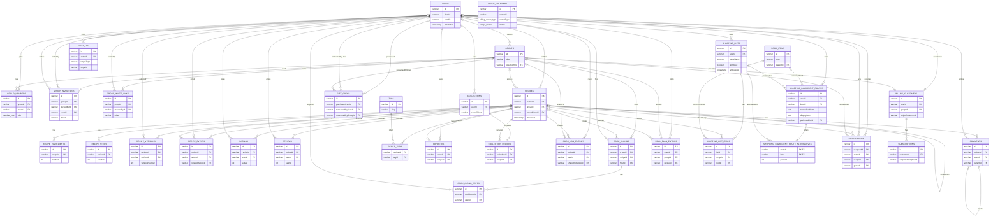

# Data model

This document maps Heirloom's Drizzle schema, delete conventions, integrity checks, and the main entity relationships.

## Source of truth

The schema source of truth is [`src/server/db/schema`](../src/server/db/schema), exported through [`src/server/db/schema/index.ts`](../src/server/db/schema/index.ts). The SQL files under [`drizzle/`](../drizzle/) are generated from that schema with `pnpm db:generate`. [`drizzle/README.md`](../drizzle/README.md) says not to hand-edit already committed migrations. For destructive schema work, follow the expand/contract and forward-fix guidance in [`docs/migrations.md`](./migrations.md).

## Shared column helpers

[`src/server/db/schema/_shared.ts`](../src/server/db/schema/_shared.ts) defines the shared column helpers used across the schema:

- `pk()` creates a `varchar(24)` primary key with a cuid2 default (`createId()`).
- `fk()` creates a `varchar(24)` foreign-key-width column.
- `timestamps()` adds `createdAt` and `updatedAt` timestamp columns. Both default to `now()`, and `updatedAt` uses Drizzle's `$onUpdate`.
- `softDelete(() => users.id)` adds `deletedAt` plus `deletedBy`. `deletedBy` references `users.id` with `onDelete: "set null"`.

## Delete conventions

The schema uses both hard cascades and soft deletes, depending on whether child history should survive.

### Soft-delete convention

Recipe deletion is a tombstone, not a hard delete. [`recipes`](../src/server/db/schema/recipes.ts) includes the `_shared.ts` soft-delete pair:

- `deletedAt IS NULL` means the recipe is live.
- A non-null `deletedAt` hides the recipe while preserving children such as versions, events, ratings, comments, and reviews.
- `deletedBy` records the actor and is set to null if that user is later removed.
- Hot recipe lookup indexes (`recipes_author_idx`, `recipes_group_idx`, `recipes_visibility_idx`) are partial indexes scoped to `deletedAt IS NULL`.

The read layer mirrors this convention: [`src/server/recipes/queries.ts`](../src/server/recipes/queries.ts) defines a shared `notDeleted = isNull(recipes.deletedAt)` predicate and applies it to recipe list/detail/search/timeline reads.

Users used to have a soft-delete-style tombstone in [`users`](../src/server/db/schema/users.ts).
Account deletion now removes the `users` row and personal profile rather than retaining that
pseudonymous account. Contributions accepted into a shared recipe may survive without a user
reference, and an owned recipe with accepted co-creators becomes unclaimed. See
[ADR-0009](./architecture/0009-account-deletion-and-shared-recipes.md).

### Cascade and set-null convention

The schema generally uses:

- `onDelete: "cascade"` for rows that are owned by the parent and should disappear with it, such as `group_members` under `groups`, `recipe_ingredients` under `recipes`, `collection_recipes` under `collections`, `shopping_list_items` under `shopping_lists`, and shopping ingredient routes under their preferred lists.
- `onDelete: "set null"` for authorship, attribution, and optional scope columns where the record should survive parent deletion. Examples include `groups.createdById`, `group_invitations.invitedById`, `recipe_versions.authorId`, `recipe_events.actorId`, `shopping_list_items.foodId`, `shopping_ingredient_routes.foodId`, and `audit_log.actorId`.
- `onDelete: "restrict"` where a cascade would pre-empt lifecycle work. `recipes.authorId` stays
  restrictive even though it is nullable: account deletion must deliberately make a co-created
  recipe unclaimed or delete it. `media_assets.userId` and `custodianRecipeId` are restrictive so a
  cascade cannot discard the only record of Cloudinary bytes before they are transferred or
  destroyed.

Some relationships are intentionally not database FKs. For example, [`audit_log.targetId`](../src/server/db/schema/audit.ts), [`reactions.targetId`](../src/server/db/schema/reactions.ts), and [`usage_counters.ownerId`](../src/server/db/schema/billing.ts) are polymorphic or cross-table identifiers, so the schema stores the id plus a type instead of a single FK.

## Index and check conventions

Foreign-key columns that are used for reverse lookups or delete actions are covered by indexes, following issue #153. The convention is asserted in [`src/server/db/schema/fk-indexes.test.ts`](../src/server/db/schema/fk-indexes.test.ts) and appears throughout schema files, for example `ratings_user_idx`, `comments_user_idx`, `recipe_versions_author_idx`, `recipe_events_actor_idx`, `shopping_list_items_food_idx`, the shopping route indexes, `notifications_actor_idx`, and the billing/gift-code owner indexes.

The schema also uses DB-level `CHECK` constraints as a backstop for Zod validation:

- [`billing_customers_owner_check`](../src/server/db/schema/billing.ts) enforces user/group owner XOR.
- [`group_invitations_contact_check`](../src/server/db/schema/groups.ts) requires either `email` or `handle`.
- [`ratings_value_range_check`](../src/server/db/schema/engagement.ts) and [`reviews_rating_range_check`](../src/server/db/schema/reviews.ts) enforce 1-5 stars.
- [`recipes`](../src/server/db/schema/recipes.ts) constrains servings, time fields, rating aggregates, nutrition fields, rest time, and ingredient step positions.
- [`shopping_list_items`](../src/server/db/schema/shopping.ts) and `recipe_ingredients` constrain non-negative quantities and valid quantity ranges. Shopping items also keep a stable base requirement separate from optional package purchase results, while ingredient routes require a complete, positive package size. Shopping route alternatives require a non-negative display position.

## Slug namespaces

Recipe URLs are namespaced by their author (issue #666, [ADR-0002](./architecture/0002-user-scoped-recipe-slugs.md)), so uniqueness is scoped rather than global:

- `users.slug` is app-owned, `NOT NULL`, and globally unique. It is deliberately _not_ Clerk's `handle`, which is nullable and overwritten by every `user.updated` webhook.
- `recipes.slug` is unique per author (`recipes_author_slug_uq`), so two cooks can each hold `blueberry-muffins`.
- `user_slug_aliases` and `recipe_slug_aliases` retain every released slug forever, and an alias counts as _occupied_ when allocating a new slug. That is what keeps redirects honest: a released slug can never be re-claimed by someone else, so an old link can never silently resolve to different content. Redirects are still issued only after the viewer passes the normal visibility check, so an alias never reveals a recipe they cannot see.
- `recipe_slug_aliases.legacy` marks the rows seeded by the namespacing migration from the pre-namespacing globally-unique slugs. A partial unique index over those rows keeps a flat `/recipes/<slug>` link resolving to exactly one recipe forever.
- Renaming a recipe regenerates its slug and retains the outgoing one. Account **deletion** is different again: since #678 the `users` row, its slug and all its aliases are deleted outright, so those URLs 404 (not 410 — a 410 would confirm a recipe once existed there) and the slugs become claimable by someone else. That is consistent with the alias-occupancy rule above: an alias _row_ occupies a slug, and after erasure there is no row. The residual link-hijack risk is an accepted trade-off recorded in [ADR-0004](./architecture/0004-account-erasure.md).

### Co-creator namespaces (issue #668)

A recipe can also resolve inside a co-creator's namespace, so `/recipes/ada/blueberry-muffins` and `/recipes/john/blueberry-muffins` can be the same document. The owner's path stays canonical. See [ADR-0003](./architecture/0003-multi-creator-recipes.md).

- `recipe_creators` holds one row per co-creator, with the slug the recipe answers on inside _that user's_ namespace. The owner is deliberately absent from the table: it is `recipes.authorId`, a `NOT NULL` FK, so exactly one owner is guaranteed and a second representation could only drift. That also makes the zero-creator state unreachable.
- `status` is `pending` until the invitee accepts. A pending row grants **nothing** — no access, no slug, no URL — and a DB CHECK ties `slug`/`accepted_at` to the status so a half-applied acceptance isn't representable. Adding a creator publishes a recipe under _their_ public namespace, so it needs the invitee's consent as well as the owner's.
- A creator's slug is allocated on accept from the recipe's _title_ slug and perturbs strictly within the accepting user's namespace, so the owner's slug is never disturbed. It is also not re-slugged when the owner renames the recipe: a creator's URL is stable once allocated, which keeps rename O(1) instead of writing an alias per creator.
- **Removal writes no alias**, deliberately diverging from the alias-permanence rule above. The difference is a trust boundary: a rename alias stays within one owner, so the redirect is honest. An ex-creator's alias would point across a relationship that was just revoked, and would either leak the recipe's continued existence and current canonical URL to anyone holding the old link, or permanently burn a slug in the ex-creator's own namespace as a side effect of losing access. Removal therefore hard-stops — the row goes, the slug is free again, and the path 404s as if it had never resolved. The only party who can re-claim that freed slug is the ex-creator themselves, inside their own namespace, so no ambiguity is introduced.
- A namespace is shared by three tables — `recipes`, `recipe_slug_aliases`, `recipe_creators` — each with its _own_ unique constraint, and Postgres has no cross-table unique. Two transactions could otherwise both probe a candidate as free and both commit it in different tables, violating nothing and so never retrying. `slugTaken` takes a transaction-scoped advisory lock on the namespace before probing all three, which closes that window. The lock supplements the constraints; they remain the source of truth.
- An **accepted** co-creator may rewrite the recipe body (#685). Delete, restore, visibility, share-token rotation, version reverts and creator management stay owner-only. `updateRecipe` therefore authorizes on the _actor_ but allocates slugs and writes aliases against `recipes.authorId`: a co-creator's rename re-slugs in the owner's namespace, and the co-creator's own mirror slug does not move.
- `recipe_creators` is also the survival predicate for account deletion: an owned recipe with an
  accepted creator becomes unclaimed rather than forcing ownership onto that person. Existing
  accepted creators may continue editing and may explicitly claim it. See
  [ADR-0009](./architecture/0009-account-deletion-and-shared-recipes.md).

## Account and personal-profile deletion (issues #678 and #694)

Account deletion removes the account, profile, and solely owned content. Shared contributions may
remain without a live account reference; the product discloses that text and images may still be
identifying from their content or family context. See
[ADR-0009](./architecture/0009-account-deletion-and-shared-recipes.md).

- `deletion_records` is the tombstone that outlives the erased row, and exists for two jobs: evidencing that the erasure happened, and telling the backup runbook _who_ to re-erase after a restore. It stores **salted hashes and counts only** — never an email, name, handle, slug, raw id, or any free text — because a record rich enough to be useful would otherwise re-create the profile the erasure just removed. The salt comes from `DELETION_HASH_SALT`; without it deletion fails closed. The tombstone and account deletion commit in the same transaction.
- A recipe survives its owner's deletion only if another **accepted** creator remains. It becomes
  ownerless at `/recipes/unclaimed/<recipe-id>` until an accepted creator explicitly claims it.
- Retained version rows lose their author reference and render as **Unknown contributor**.
- Media used by retained owned recipes transfers to their recipe owner. Media attached only to an
  unclaimed recipe becomes system-custodied by that recipe. Its stored Cloudinary resource type
  makes later image, video, and raw deletion exact. Remaining media is destroyed.
- Ordering is enforced by restrictive foreign keys and one transaction: lock/classify recipes →
  transfer retained media → destroy remaining Cloudinary bytes → transition or delete recipes →
  delete `users` → write the tombstone. The committed state is then checked for live identity
  references.

## Main tables

| Table                                    | Source                                                         | Purpose                                                                                                                       |
| ---------------------------------------- | -------------------------------------------------------------- | ----------------------------------------------------------------------------------------------------------------------------- |
| `users`                                  | [`users.ts`](../src/server/db/schema/users.ts)                 | Local app users mirrored from Clerk, with the app-owned URL `slug`, digest preference, and account tombstone.                 |
| `user_slug_aliases`                      | [`users.ts`](../src/server/db/schema/users.ts)                 | Permanent history of released user slugs, so an old namespaced link still redirects.                                          |
| `groups`                                 | [`groups.ts`](../src/server/db/schema/groups.ts)               | Family/group cookbook container with a unique slug and optional creator attribution.                                          |
| `group_members`                          | [`groups.ts`](../src/server/db/schema/groups.ts)               | User membership and role (`owner`, `admin`, `member`, `kid`) within a group.                                                  |
| `group_invitations`                      | [`groups.ts`](../src/server/db/schema/groups.ts)               | Single-invitee group invitations by email and/or handle.                                                                      |
| `group_invite_links`                     | [`groups.ts`](../src/server/db/schema/groups.ts)               | Shareable multi-use invite links with expiry, use limits, and revocation.                                                     |
| `recipes`                                | [`recipes.ts`](../src/server/db/schema/recipes.ts)             | Core recipe record, visibility, provenance, nutrition, sharing, rating aggregates, and soft delete.                           |
| `recipe_ingredients`                     | [`recipes.ts`](../src/server/db/schema/recipes.ts)             | Ordered ingredient lines for a recipe.                                                                                        |
| `recipe_steps`                           | [`recipes.ts`](../src/server/db/schema/recipes.ts)             | Ordered instruction steps, timers, media, temperatures, and techniques.                                                       |
| `recipe_versions`                        | [`recipes.ts`](../src/server/db/schema/recipes.ts)             | Immutable recipe snapshots with monotonically allocated version numbers.                                                      |
| `recipe_events`                          | [`recipes.ts`](../src/server/db/schema/recipes.ts)             | Append-only recipe timeline events such as created, adapted, updated, and published.                                          |
| `recipe_slug_aliases`                    | [`recipes.ts`](../src/server/db/schema/recipes.ts)             | Permanent history of released recipe slugs per namespace, plus the seeded legacy flat-URL slugs.                              |
| `recipe_creators`                        | [`recipes.ts`](../src/server/db/schema/recipes.ts)             | Co-creators of a recipe and the slug it answers on inside each of their namespaces. Pending rows grant nothing.               |
| `recipe_nutrition_cache`                 | [`nutrition.ts`](../src/server/db/schema/nutrition.ts)         | Derived per-serving nutrition with its provenance, stamped with the resolver version that produced it.                        |
| `tags`                                   | [`engagement.ts`](../src/server/db/schema/engagement.ts)       | Shared free-form recipe tags.                                                                                                 |
| `recipe_tags`                            | [`engagement.ts`](../src/server/db/schema/engagement.ts)       | Join table between recipes and tags.                                                                                          |
| `ratings`                                | [`engagement.ts`](../src/server/db/schema/engagement.ts)       | Lightweight one-tap 1-5 star ratings, one per user per recipe.                                                                |
| `comments`                               | [`engagement.ts`](../src/server/db/schema/engagement.ts)       | Threaded comments and anchored suggestions on recipes.                                                                        |
| `reviews`                                | [`reviews.ts`](../src/server/db/schema/reviews.ts)             | Written recipe reviews with an independent 1-5 rating and optional photo.                                                     |
| `favorites`                              | [`collections.ts`](../src/server/db/schema/collections.ts)     | Per-user recipe bookmarks.                                                                                                    |
| `collections`                            | [`collections.ts`](../src/server/db/schema/collections.ts)     | User-owned personal cookbooks with private/unlisted/public visibility.                                                        |
| `collection_recipes`                     | [`collections.ts`](../src/server/db/schema/collections.ts)     | Ordered recipes inside a collection.                                                                                          |
| `recipe_views`                           | [`views.ts`](../src/server/db/schema/views.ts)                 | Recently viewed recipes, one row per user and recipe.                                                                         |
| `saved_searches`                         | [`searches.ts`](../src/server/db/schema/searches.ts)           | User-saved normalized recipe search query strings.                                                                            |
| `cook_log_entries`                       | [`cooklog.ts`](../src/server/db/schema/cooklog.ts)             | "I cooked this" entries with optional notes, photos, family sharing, and moderation hide fields.                              |
| `cook_alongs`                            | [`cookalong.ts`](../src/server/db/schema/cookalong.ts)         | Scheduled family cook-along events for a recipe.                                                                              |
| `cook_along_rsvps`                       | [`cookalong.ts`](../src/server/db/schema/cookalong.ts)         | One RSVP per user per cook-along.                                                                                             |
| `reactions`                              | [`reactions.ts`](../src/server/db/schema/reactions.ts)         | Polymorphic emoji reactions on comments, reviews, and cook-log posts.                                                         |
| `notifications`                          | [`notifications.ts`](../src/server/db/schema/notifications.ts) | In-app notification rows for one recipient.                                                                                   |
| `user_blocks`                            | [`moderation.ts`](../src/server/db/schema/moderation.ts)       | One-way user blocks.                                                                                                          |
| `content_reports`                        | [`moderation.ts`](../src/server/db/schema/moderation.ts)       | Reports for comments, reviews, and cook-log posts.                                                                            |
| `shopping_lists`                         | [`shopping.ts`](../src/server/db/schema/shopping.ts)           | User-owned grocery lists with optional store identity, explicit default selection, and archiving.                             |
| `shopping_list_items`                    | [`shopping.ts`](../src/server/db/schema/shopping.ts)           | Consolidated lines with stable required measures and separate optional package purchase results.                              |
| `shopping_ingredient_routes`             | [`shopping.ts`](../src/server/db/schema/shopping.ts)           | Per-ingredient store, package-size, label, and rounding preferences keyed by food or normalized text.                         |
| `shopping_ingredient_route_alternatives` | [`shopping.ts`](../src/server/db/schema/shopping.ts)           | Ordered alternative lists for a shopping ingredient route; alternatives do not duplicate items.                               |
| `meal_plan_entries`                      | [`planner.ts`](../src/server/db/schema/planner.ts)             | Weekly meal-plan slots for a user, optionally scoped to a group and/or recipe.                                                |
| `member_dietary_profiles`                | [`dietary.ts`](../src/server/db/schema/dietary.ts)             | Per-person dietary/allergen profiles owned by a user and optionally scoped to a group.                                        |
| `nutrition_targets`                      | [`dietary.ts`](../src/server/db/schema/dietary.ts)             | Versioned daily macro targets per profile, keyed by effective-from date so past weeks keep the target they were cooked under. |
| `billing_customers`                      | [`billing.ts`](../src/server/db/schema/billing.ts)             | Stripe customer mapping for exactly one user or group owner.                                                                  |
| `subscriptions`                          | [`billing.ts`](../src/server/db/schema/billing.ts)             | Synced Stripe subscription state, plan, trial, period, cancellation, and seats.                                               |
| `usage_counters`                         | [`billing.ts`](../src/server/db/schema/billing.ts)             | Metered usage keyed by owner id/type, metric, and period.                                                                     |
| `gift_codes`                             | [`billing.ts`](../src/server/db/schema/billing.ts)             | One-time Family gift purchases and redemption state.                                                                          |
| `audit_log`                              | [`audit.ts`](../src/server/db/schema/audit.ts)                 | Append-only security audit trail for sensitive authorization-changing actions.                                                |
| `waitlist_signups`                       | [`waitlist.ts`](../src/server/db/schema/waitlist.ts)           | Landing-page email capture with source tagging.                                                                               |

## Entity relationship diagram

The diagram focuses on the core relationships declared in `relations()` and `.references()` calls. Optional/set-null relationships are labeled where useful. Polymorphic pointers such as `audit_log.targetId`, `reactions.targetId`, and `usage_counters.ownerId` are noted as columns but are not FK edges.

```mermaid
erDiagram
  USERS {
    varchar id PK
    varchar clerkId
    varchar handle
    timestamp deletedAt
  }
  GROUPS {
    varchar id PK
    varchar slug
    varchar createdById FK
  }
  GROUP_MEMBERS {
    varchar id PK
    varchar groupId FK
    varchar userId FK
    member_role role
  }
  GROUP_INVITATIONS {
    varchar id PK
    varchar groupId FK
    varchar invitedById FK
    varchar userId FK
    varchar token
  }
  GROUP_INVITE_LINKS {
    varchar id PK
    varchar groupId FK
    varchar createdById FK
    varchar token
  }
  RECIPES {
    varchar id PK
    varchar authorId FK
    varchar groupId FK
    varchar forkedFromId FK
    timestamp deletedAt
  }
  RECIPE_INGREDIENTS {
    varchar id PK
    varchar recipeId FK
    int position
  }
  FOOD_ITEMS {
    varchar id PK
    varchar slug
    varchar parentId FK
  }
  RECIPE_STEPS {
    varchar id PK
    varchar recipeId FK
    int position
  }
  RECIPE_VERSIONS {
    varchar id PK
    varchar recipeId FK
    varchar authorId FK
    int versionNumber
  }
  RECIPE_EVENTS {
    varchar id PK
    varchar recipeId FK
    varchar actorId FK
    varchar relatedRecipeId FK
  }
  RATINGS {
    varchar id PK
    varchar recipeId FK
    varchar userId FK
    int value
  }
  REVIEWS {
    varchar id PK
    varchar recipeId FK
    varchar userId FK
    int rating
  }
  COMMENTS {
    varchar id PK
    varchar recipeId FK
    varchar userId FK
    varchar parentId FK
  }
  TAGS {
    varchar id PK
    varchar slug
  }
  RECIPE_TAGS {
    varchar recipeId FK
    varchar tagId FK
  }
  FAVORITES {
    varchar id PK
    varchar userId FK
    varchar recipeId FK
  }
  COLLECTIONS {
    varchar id PK
    varchar userId FK
    varchar shareToken
  }
  COLLECTION_RECIPES {
    varchar id PK
    varchar collectionId FK
    varchar recipeId FK
  }
  COOK_LOG_ENTRIES {
    varchar id PK
    varchar recipeId FK
    varchar userId FK
    varchar sharedToGroupId FK
  }
  COOK_ALONGS {
    varchar id PK
    varchar groupId FK
    varchar recipeId FK
    varchar hostId FK
  }
  COOK_ALONG_RSVPS {
    varchar id PK
    varchar cookAlongId FK
    varchar userId FK
  }
  MEAL_PLAN_ENTRIES {
    varchar id PK
    varchar userId FK
    varchar groupId FK
    varchar recipeId FK
  }
  SHOPPING_LISTS {
    varchar id PK
    varchar userId FK
    varchar storeName
    boolean isDefault
    timestamp archivedAt
  }
  SHOPPING_LIST_ITEMS {
    varchar id PK
    varchar listId FK
    varchar recipeId FK
    varchar foodId FK
  }
  SHOPPING_INGREDIENT_ROUTES {
    varchar id PK
    varchar userId FK
    varchar foodId FK
    text normalizedItem
    text displayItem
    varchar preferredListId FK
  }
  SHOPPING_INGREDIENT_ROUTE_ALTERNATIVES {
    varchar routeId PK, FK
    varchar listId PK, FK
    int position
  }
  NOTIFICATIONS {
    varchar id PK
    varchar recipientId FK
    varchar actorId FK
    varchar recipeId FK
    varchar groupId FK
  }
  AUDIT_LOG {
    varchar id PK
    varchar actorId FK
    varchar targetType
    varchar targetId
  }
  BILLING_CUSTOMERS {
    varchar id PK
    varchar userId FK
    varchar groupId FK
    varchar stripeCustomerId
  }
  SUBSCRIPTIONS {
    varchar id PK
    varchar customerId FK
    varchar stripeSubscriptionId
  }
  USAGE_COUNTERS {
    varchar id PK
    varchar ownerId
    billing_owner_type ownerType
    usage_metric metric
  }
  GIFT_CODES {
    varchar id PK
    varchar purchaserUserId FK
    varchar redeemedByUserId FK
    varchar redeemedByGroupId FK
  }

  USERS ||--o{ GROUP_MEMBERS : joins
  GROUPS ||--o{ GROUP_MEMBERS : has
  USERS o|--o{ GROUPS : creates
  GROUPS ||--o{ GROUP_INVITATIONS : sends
  USERS o|--o{ GROUP_INVITATIONS : invitedBy
  USERS o|--o{ GROUP_INVITATIONS : invitee
  GROUPS ||--o{ GROUP_INVITE_LINKS : owns
  USERS o|--o{ GROUP_INVITE_LINKS : createdBy

  USERS ||--o{ RECIPES : authors
  GROUPS o|--o{ RECIPES : scopes
  RECIPES o|--o{ RECIPES : forkedFrom
  RECIPES ||--o{ RECIPE_INGREDIENTS : has
  RECIPES ||--o{ RECIPE_STEPS : has
  RECIPES ||--o{ RECIPE_VERSIONS : snapshots
  USERS o|--o{ RECIPE_VERSIONS : authored
  RECIPES ||--o{ RECIPE_EVENTS : timeline
  USERS o|--o{ RECIPE_EVENTS : acted
  RECIPES o|--o{ RECIPE_EVENTS : related
  RECIPES ||--o{ RATINGS : receives
  USERS ||--o{ RATINGS : gives
  RECIPES ||--o{ REVIEWS : receives
  USERS ||--o{ REVIEWS : writes
  RECIPES ||--o{ COMMENTS : has
  USERS ||--o{ COMMENTS : writes
  COMMENTS o|--o{ COMMENTS : replies
  RECIPES ||--o{ RECIPE_TAGS : tagged
  TAGS ||--o{ RECIPE_TAGS : labels

  USERS ||--o{ FAVORITES : saves
  RECIPES ||--o{ FAVORITES : saved
  USERS ||--o{ COLLECTIONS : owns
  COLLECTIONS ||--o{ COLLECTION_RECIPES : contains
  RECIPES ||--o{ COLLECTION_RECIPES : included
  USERS ||--o{ COOK_LOG_ENTRIES : cooks
  RECIPES ||--o{ COOK_LOG_ENTRIES : cooked
  GROUPS o|--o{ COOK_LOG_ENTRIES : sharedTo
  GROUPS ||--o{ COOK_ALONGS : hosts
  RECIPES ||--o{ COOK_ALONGS : cooks
  USERS o|--o{ COOK_ALONGS : host
  COOK_ALONGS ||--o{ COOK_ALONG_RSVPS : has
  USERS ||--o{ COOK_ALONG_RSVPS : responds
  USERS ||--o{ MEAL_PLAN_ENTRIES : plans
  GROUPS o|--o{ MEAL_PLAN_ENTRIES : scopes
  RECIPES o|--o{ MEAL_PLAN_ENTRIES : planned
  USERS ||--o{ SHOPPING_LISTS : owns
  SHOPPING_LISTS ||--o{ SHOPPING_LIST_ITEMS : has
  RECIPES o|--o{ SHOPPING_LIST_ITEMS : source
  FOOD_ITEMS o|--o{ SHOPPING_LIST_ITEMS : canonicalFood
  USERS ||--o{ SHOPPING_INGREDIENT_ROUTES : owns
  FOOD_ITEMS o|--o{ SHOPPING_INGREDIENT_ROUTES : canonicalFood
  SHOPPING_LISTS ||--o{ SHOPPING_INGREDIENT_ROUTES : preferredFor
  SHOPPING_INGREDIENT_ROUTES ||--o{ SHOPPING_INGREDIENT_ROUTE_ALTERNATIVES : offers
  SHOPPING_LISTS ||--o{ SHOPPING_INGREDIENT_ROUTE_ALTERNATIVES : alternativeFor
  USERS ||--o{ NOTIFICATIONS : receives
  USERS o|--o{ NOTIFICATIONS : acts
  RECIPES o|--o{ NOTIFICATIONS : aboutRecipe
  GROUPS o|--o{ NOTIFICATIONS : aboutGroup
  USERS o|--o{ AUDIT_LOG : actor

  USERS o|--o| BILLING_CUSTOMERS : userOwner
  GROUPS o|--o| BILLING_CUSTOMERS : groupOwner
  BILLING_CUSTOMERS ||--o{ SUBSCRIPTIONS : has
  USERS o|--o{ GIFT_CODES : purchased
  USERS o|--o{ GIFT_CODES : redeemedByUser
  GROUPS o|--o{ GIFT_CODES : redeemedByGroup
```

## Generated and hand-maintained database objects

Most tables, columns, indexes, checks, and FKs are declared in Drizzle and generated into `drizzle/*.sql`. A few database objects are intentionally maintained in migrations rather than modeled as Drizzle columns: [`recipes.ts`](../src/server/db/schema/recipes.ts) documents the full-text search `search_vector` generated column, its GIN index, and `pg_trgm` indexes for ingredient/tag fallbacks.

_Related issue: #196._
