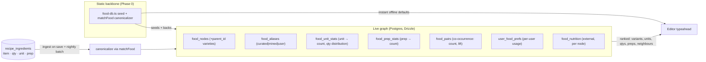

# Food graph — design & ADR

**Status:** Proposed (design only; no schema/code beyond the Phase 0 static
food‑DB has been built yet)
**Related:** [`src/lib/food-db.ts`](../src/lib/food-db.ts),
[`src/lib/food-units.ts`](../src/lib/food-units.ts),
[`src/server/db/schema/ingredients.ts`](../src/server/db/schema/ingredients.ts),
[`docs/data-model.md`](./data-model.md), the interchangeable‑units work
(`src/lib/units.ts`, recipe editor unit picker)

## 1. Vision

Evolve the food/ingredient data from a **static curated table** into a **live,
crowd‑sourced knowledge graph of foods, mined from the recipes on the site**.
It should power:

- **Smart ingredient entry** — typing "onion" surfaces the canonical food, its
  **varieties** (yellow/red/white/green), its **common units** (`ct` = 1 whole,
  cups, oz), **common quantities**, and **prep methods** (whole, diced,
  julienned) — ranked by overall popularity *and* what this user tends to use.
- **Near‑neighbour suggestions** — after adding onion to a pasta dish, tomato
  surfaces quickly because it co‑occurs with onion across many recipes.
- **Richer food facts over time** — nutrition, and reverse links to the
  recipes that use a food.

This document defines the data model, the ingestion/serving architecture, the
key decisions, and a phased roadmap, so we can align (including with the
interchangeable‑units session) **before** writing schema or code.

## 2. Goals / non‑goals

**Goals**
- One canonical **food identity** per ingredient, with everything else
  (varieties, units, quantities, prep, pairings, nutrition) hanging off it.
- Learn from the corpus we already have: `recipe_ingredients` already stores
  `item`, `quantity`, `unit`, `prep`, `section` per line — the raw signal.
- Keep the editor **fast and offline‑capable**: instant local defaults, live
  graph enriches when online.
- Don't break the units session: preserve the `getSuggestedUnitsForFood`
  contract; add new sibling APIs rather than changing it.

**Non‑goals (for now)**
- A dedicated graph database. At recipe‑site scale a Postgres adjacency (edge)
  table with the right indexes is simpler and sufficient (see ADR‑1).
- Authoritative branded/packaged nutrition. Nutrition starts from a public,
  generic source (see §7 and ADR‑4).
- Real‑time ML recommendations. Ranking is transparent counts + lift +
  light personalization (see §6).

## 3. What exists today (Phase 0, shipped)

- **`food-db.ts`** — a curated static dataset: a 19‑category taxonomy, ~120
  foods with densities, and a tolerant `matchFood(item)` normalizer
  (lowercase, strip accents/parentheticals, before‑first‑comma, whole‑word
  longest‑match‑wins).
- **`food-units.ts`** — `getSuggestedUnitsForFood(item)` returning ordered
  `{ dimension, unit }[]` per food category.
- **`food_items` table** — a DB mirror seeded from the static set.

**These are not throwaway.** In the live design they become:
- the **cold‑start seed** (a brand‑new site / a food with no recipes yet still
  gets sensible variants/units),
- the **canonical backbone** (identity, category, density),
- the **offline default** for the editor,
- and `matchFood` becomes the **ingestion canonicalizer** that maps noisy crowd
  free‑text onto canonical nodes.

## 4. Architecture



Two planes:

1. **Write / derivation plane.** Every recipe create/update feeds its ingredient
   lines through `matchFood` to resolve (or propose) a canonical node, then folds
   the line into the aggregate tables (unit/qty/prep stats, pair edges, per‑user
   prefs). A **nightly batch** recomputes from scratch for consistency and to
   fold in unmatched‑text clustering.
2. **Read / serving plane.** The editor calls a thin server API for ranked
   suggestions, and falls back to the static lib for instant/offline defaults.
   Same `getSuggestedUnitsForFood` signature; new sibling APIs for the rest.

## 5. Data model

Uses the shared helpers in
[`_shared.ts`](../src/server/db/schema/_shared.ts) (`pk`, `fk`, `timestamps`).
Illustrative, not final.

### 5.1 Identity vs. modifiers (key modelling decision)

- **Canonical node** = a food *identity* (Onion, Tomato). Nutritionally and
  semantically distinct things are distinct nodes.
- **Variety** (yellow/red/white/green onion) = a **child node** with
  `parent_id` → Onion. Varieties can differ in flavour/nutrition and are worth
  first‑classing.
- **Size** (large/medium/small) and **prep** (diced/julienned) = **orthogonal
  modifiers**, *not* identity. They're learned as stats/facets, because "large"
  changes a count→weight conversion and "diced" changes nothing about identity.

This keeps the node graph clean and pushes the messy, high‑cardinality stuff
(sizes, preps, phrasings) into stat tables where it belongs.

### 5.2 Tables

**`food_nodes`** — canonical foods + varieties.
`id` pk · `slug` unique · `name` · `category` · `parentId` fk→food_nodes
(nullable; set for varieties) · `densityGPerMl` real? · `source`
(`curated|mined`) · `recipeCount` int (denormalized popularity) · `timestamps`.
This is `food_items` promoted (add `parentId`, `source`, `recipeCount`).

**`food_aliases`** — every phrasing that resolves to a node.
`id` pk · `foodId` fk→food_nodes · `alias` (normalized) · `source`
(`curated|mined|user`) · `useCount` int · `timestamps`. Unique on
(`foodId`,`alias`). Curated aliases seed it; mined aliases accrue from the
corpus; `useCount` powers "did you mean" ranking and promotion of a frequent
alias to a real variety node.

**`food_unit_stats`** — unit + quantity affinity per food.
`foodId` fk · `unit` (canonical, from `units.ts`) · `useCount` int · quantity
distribution (either bucketed `p10/p50/p90` reals, or a small JSON histogram of
common amounts). PK (`foodId`,`unit`). Answers "what units and what common
amounts do people use for this food."

**`food_prep_stats`** — prep affinity per food.
`foodId` fk · `prep` (normalized) · `useCount` int. PK (`foodId`,`prep`).
Sourced from the existing `recipe_ingredients.prep` column.

**`food_pairs`** — co‑occurrence edges (the "graph").
`foodAId` fk · `foodBId` fk (store with `foodAId < foodBId` so each undirected
pair is one row) · `coCount` int (recipes containing both) · `lift` real
(precomputed nightly). PK (`foodAId`,`foodBId`), plus an index on `foodAId` and
on `foodBId` for neighbour lookups. `lift = P(A,B) / (P(A)·P(B))`; rank
neighbours by `lift` with a `coCount` floor (see §6).

**`user_food_prefs`** — personalization.
`userId` fk · `foodId` fk · `preferredUnit`? · `preferredVariantId`? ·
`preferredPrep`? · `useCount` int · `timestamps`. PK (`userId`,`foodId`).
Derived from that user's own recipes; used to re‑rank the shared suggestions.

**`food_nutrition`** — external enrichment (Phase 4).
`foodId` fk (unique) · per‑100g macros (`kcal`, `proteinG`, `carbsG`, `fatG`,
…) · `sourceRef` (e.g. USDA FDC id) · `timestamps`. Deliberately per canonical
node, from an authoritative source — not crowd‑sourced (ADR‑4).

## 6. Ranking

- **Popularity**: `useCount` / `recipeCount`.
- **Near‑neighbours**: order candidate foods by `lift` (surfaces *distinctive*
  pairings — onion→tomato, not onion→salt which co‑occurs with everything),
  gated by a minimum `coCount` so a single quirky recipe can't create an edge.
- **Personalization**: blend the shared ranking with `user_food_prefs` (a
  user's own most‑used variant/unit/prep floats to the top) using a simple
  weighted merge, not a model.
- **Cold start**: when a food has thin/no live data, fall back to the static
  category defaults from `food-units.ts`.

## 7. Nutrition sourcing

Nutrition is authoritative, not crowd‑sourced. Proposed source: **USDA
FoodData Central** (public domain, generic "Foundation"/"SR Legacy" foods).
Store per canonical node, per 100 g, with the FDC id in `sourceRef`. Branded /
packaged nutrition is explicitly out of scope for v1 (licensing + accuracy).
This is Phase 4 and independent of the crowd‑sourced graph.

## 8. Privacy, quality & moderation

- **k‑anonymity for surfacing**: only surface a mined variety / alias / pairing
  once it has support from **≥ N distinct recipes (and ideally ≥ N users)**, so
  a suggestion never reveals one person's private recipe.
- **Canonicalization gate**: unmatched free‑text isn't shown raw — it stays as a
  low‑confidence mined alias until it crosses the threshold, then gets promoted.
- **Spam/garbage resistance**: aggregate counts + thresholds naturally dampen
  one‑off noise; a lightweight blocklist/normalizer handles obvious junk.
- **Personalization data** stays per‑user and private; only anonymous aggregate
  counts feed the shared graph. Fits the existing privacy posture in
  [`docs/data-model.md`](./data-model.md).

## 9. Serving API (contract)

Preserve the units session's integration; **add**, don't change:

```ts
// unchanged — units session already wires this
getSuggestedUnitsForFood(item): SuggestedUnit[]

// new siblings (server-backed, live; static fallback offline)
getFoodMatch(item): { node, confidence }              // canonical resolution
getVariantsForFood(item, opts?): FoodVariant[]         // ranked, personalizable
getCommonQuantitiesForFood(item, unit?): QtySuggestion[]
getPrepsForFood(item): PrepSuggestion[]
getPairedFoods(items[], opts?): FoodSuggestion[]       // near-neighbours
getRecipesUsingFood(item): RecipeRef[]                 // reverse index
```

The static lib keeps synchronous versions for instant/offline defaults; the
server versions enrich with live data. Shapes stay flat + ordered (index 0 =
default), matching the convention the units session relies on.

## 10. Decisions (ADR)

- **ADR‑1 — Postgres adjacency, not a graph DB.** At this scale, `food_pairs`
  as an indexed edge table answers neighbour queries in ms and avoids a new
  datastore. Revisit only if multi‑hop traversal becomes core.
- **ADR‑2 — Static set stays as backbone + cold start.** Keep `food-db.ts` as
  seed, offline default, and canonicalizer; the live graph augments it. Avoids a
  cold‑start dead zone and keeps the editor offline‑capable.
- **ADR‑3 — Identity vs. modifiers split (§5.1).** Varieties are nodes; size and
  prep are learned facets. Keeps the graph clean and conversions correct.
- **ADR‑4 — Nutrition is authoritative & separate.** External public‑domain
  source per node; not crowd‑sourced; not v1‑blocking.
- **ADR‑5 — Additive API.** Never change `getSuggestedUnitsForFood`; add sibling
  functions so the units session's wiring is stable.
- **ADR‑6 — Threshold‑gated surfacing.** Mined data is only shown past a support
  threshold, giving both quality and k‑anonymity.

## 11. Roadmap

- **Phase 0 — DONE.** Static food‑DB, category unit suggestions, `food_items`
  table + seed.
- **Phase 1 — Live backbone.** Promote `food_items` → `food_nodes`
  (`parentId`,`source`,`recipeCount`) + `food_aliases`. Batch‑ingest existing
  recipes to populate aliases + `food_unit_stats` + `food_prep_stats`. Enrich
  `getSuggestedUnitsForFood` from learned units (same signature); add
  `getVariantsForFood`, `getCommonQuantitiesForFood`, `getPrepsForFood`.
- **Phase 2 — Near‑neighbour graph.** `food_pairs` + nightly lift; incremental
  update on recipe save; `getPairedFoods`; editor "you might also add…".
- **Phase 3 — Personalization.** `user_food_prefs`; re‑rank per user; reverse
  index `getRecipesUsingFood`.
- **Phase 4 — Nutrition.** `food_nutrition` from USDA FDC; per‑recipe nutrition
  roll‑ups (complements the existing nutrition fields in `recipes`).

Each phase is independently shippable and additive.

## 12. Open questions

1. **Ingestion trigger** — fold on recipe save (server action) *and* nightly
   batch, or nightly‑only to start? (Leaning: nightly batch first, add
   incremental in Phase 2.)
2. **Quantity distribution storage** — percentile columns vs. a small JSON
   histogram? (Leaning: percentiles for cheap ranking.)
3. **Support threshold N** for surfacing mined data — start conservative (e.g.
   ≥ 3 recipes / ≥ 2 users)?
4. **`ct`/count unit** — the editor wants a literal `each`/`ct`; confirm the
   display token with the units session (their `units.ts` has no count
   registry, so this is a food‑graph‑owned convention).
5. **Scope of v1** — Phases 1–2 (the "smart entry + neighbours" core) before
   personalization/nutrition?
