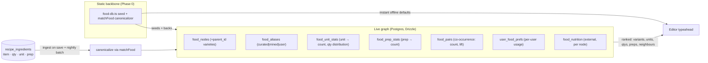
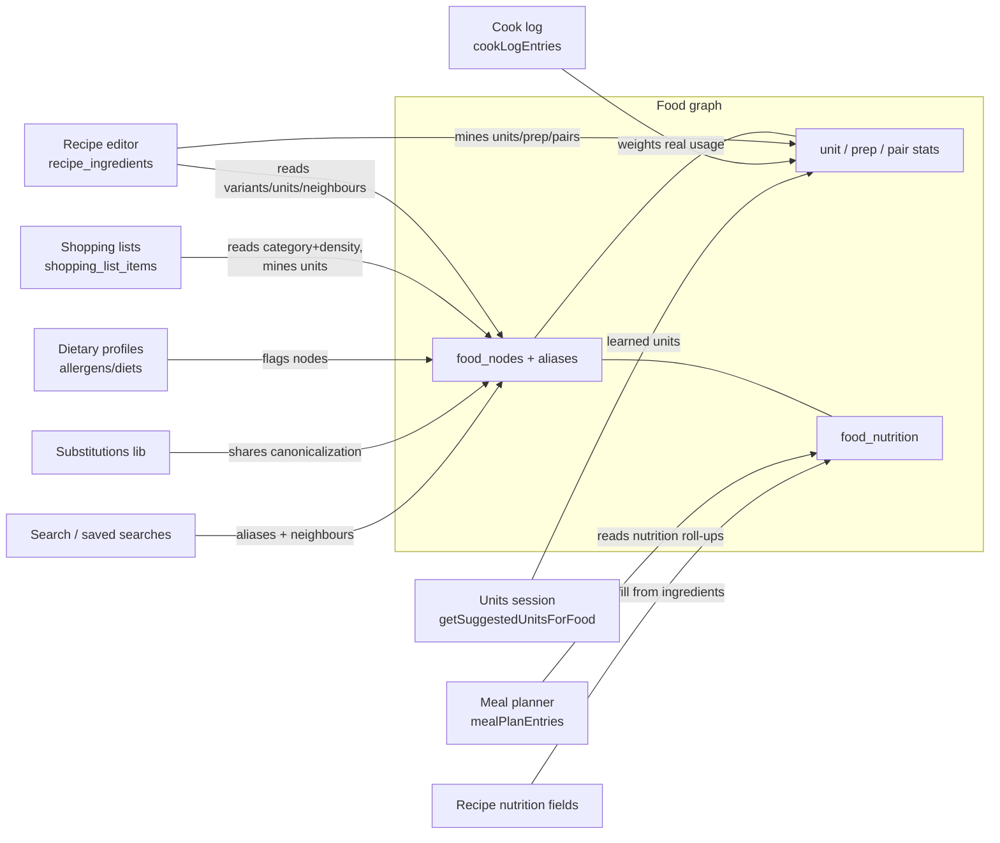

# Food graph: design & ADR

**Status:** Proposed (design only. No schema/code beyond the Phase 0 static
food‑DB has been built yet)
**Related:** [`src/lib/food-db.ts`](../src/lib/food-db.ts),
[`src/lib/food-units.ts`](../src/lib/food-units.ts),
[`src/server/db/schema/ingredients.ts`](../src/server/db/schema/ingredients.ts),
[`docs/data-model.md`](./data-model.md), the interchangeable‑units work
(`src/lib/units.ts`, recipe editor unit picker)

## 1. Vision

Evolve the food/ingredient data from a **static curated table** into a **live,
crowd‑sourced knowledge graph of foods, mined from the recipes on the site**.
Make it a **first‑class connective hub**: a shared food‑identity layer that
recipes, shopping lists, meal plans, dietary profiles, search and nutrition all
read from and feed back into, so datapoints compound across the product (§5).
It should power:

- **Smart ingredient entry**: typing "onion" surfaces the canonical food, its
  **varieties** (yellow/red/white/green), its **common units** (`ct` = 1 whole,
  cups, oz), **common quantities**, and **prep methods** (whole, diced,
  julienned). Ranked by overall popularity _and_ what this user tends to use.
- **Near‑neighbour suggestions**: after adding onion to a pasta dish, tomato
  surfaces quickly because it co‑occurs with onion across many recipes.
- **Connected features across the site**: the same canonical food powers
  shopping‑list aisle categorization + de‑duplication, one‑click shopping from a
  meal plan, dietary/allergen flagging, synonym‑aware search, and substitutions
  keyed off one identity (§5).
- **Richer food facts over time**: nutrition, and reverse links to the
  recipes that use a food.

This document defines the data model, the ingestion/serving architecture, the
key decisions, and a phased roadmap, so we can align (including with the
interchangeable‑units session) **before** writing schema or code.

## 2. Goals / non‑goals

**Goals**

- One canonical **food identity** per ingredient, with everything else
  (varieties, units, quantities, prep, pairings, nutrition) hanging off it.
- Learn from the corpus we already have: `recipe_ingredients` already stores
  `item`, `quantity`, `unit`, `prep`, `section` per line, the raw signal.
- Keep the editor **fast and offline‑capable**: instant local defaults, live
  graph enriches when online.
- Don't break the units session: preserve the `getSuggestedUnitsForFood`
  contract. Add new sibling APIs rather than changing it.

**Non‑goals (for now)**

- A dedicated graph database. At recipe‑site scale a Postgres adjacency (edge)
  table with the right indexes is simpler and sufficient (see ADR‑1).
- Authoritative branded/packaged nutrition. Nutrition starts from a public,
  generic source (see §8 and ADR‑4).
- Real‑time ML recommendations. Ranking is transparent counts + lift +
  light personalization (see §7).

## 3. What exists today (Phase 0, shipped)

- **`food-db.ts`**: a curated static dataset: a 19‑category taxonomy, ~120
  foods with densities, and a tolerant `matchFood(item)` normalizer
  (lowercase, strip accents/parentheticals, before‑first‑comma, whole‑word
  longest‑match‑wins).
- **`food-units.ts`**: `getSuggestedUnitsForFood(item)` returning ordered
  `{ dimension, unit }[]` per food category.
- **`food_items` table**: a DB mirror seeded from the static set.

**These are not throwaway.** In the live design they become:

- the **cold‑start seed** (a brand‑new site / a food with no recipes yet still
  gets sensible variants/units),
- the **canonical backbone** (identity, category, density),
- the **offline default** for the editor,
- and `matchFood` becomes the **ingestion canonicalizer** that maps noisy crowd
  free‑text onto canonical nodes.

## 4. Architecture



Two planes:

1. **Write / derivation plane.** Every recipe create/update feeds its ingredient
   lines through `matchFood` to resolve (or propose) a canonical node, then folds
   the line into the aggregate tables (unit/qty/prep stats, pair edges, per‑user
   prefs). A **nightly batch** recomputes from scratch for consistency and to
   fold in unmatched‑text clustering.
2. **Read / serving plane.** The editor calls a thin server API for ranked
   suggestions, and falls back to the static lib for instant/offline defaults.
   Same `getSuggestedUnitsForFood` signature. New sibling APIs for the rest.

## 5. The food graph as a connective hub

The graph is **not** a units helper bolted onto the editor. It is a **shared
food‑identity layer**: `food_nodes` gives the whole app _one stable id_ for
"onion" no matter how it was typed, so a signal captured in one feature enriches
every other, and any feature that touches food can read a consistent set of
facts (identity, category, density, units, variants, prep, pairings, nutrition,
allergens). This is what makes "a connected ability across datapoints" real.
The graph is the join table between recipes, users, shopping, planning, dietary
needs, and discovery.



**Integration surface** (every row is an existing table/lib in this repo):

| Feature / source                                                                            | Reads from graph                                        | Feeds the graph                                | Unlocks                                                                                             |
| ------------------------------------------------------------------------------------------- | ------------------------------------------------------- | ---------------------------------------------- | --------------------------------------------------------------------------------------------------- |
| **Recipe editor** (`recipe_ingredients`)                                                    | variants, units, common qty, prep, near‑neighbours      | aliases, unit/qty/prep, co‑occurrence, on save | smart entry + "you might also add tomato"                                                           |
| **Shopping lists** (`shopping_list_items`, already has `item`/`quantity`/`unit`/`category`) | canonical id, `category` (aisle), density for unit math | more unit/qty signal                           | auto aisle‑categorization, merge the same food across recipes, scale + unit‑convert a combined list |
| **Meal planner** (`mealPlanEntries`)                                                        | per‑node nutrition                                      |                                                | one‑click shopping list for a week and nutrition roll‑up for a plan                                 |
| **Dietary profiles** (`memberDietaryProfiles.allergens/diets`)                              | node → allergen/diet flags                              |                                                | flag/hide conflicting suggestions, warn on a recipe, drive swaps                                    |
| **Substitutions** (`substitutions.ts`)                                                      | shared canonical identity and node → swap options       | shared normalizer                              | allergen‑aware substitutions keyed off the _same_ food id                                           |
| **Cook log** (`cookLogEntries`)                                                             |                                                         | "actually cooked" weight                       | personalization ranked by real behaviour, not just saved recipes                                    |
| **Collections / favorites** (`collections`)                                                 | a user's food affinity                                  | affinity signal                                | better personalization + ingredient‑led discovery                                                   |
| **Search** (`searches`, `savedSearches`)                                                    | aliases (synonyms), neighbours                          |                                                | synonym‑aware ingredient search, "recipes using X", pantry/near‑neighbour discovery                 |
| **Reviews / ratings** (`engagement`)                                                        | recipe quality score                                    |                                                | weight mined pair/unit signal by rating so we don't learn from junk recipes                         |
| **Recipe nutrition** (`recipes.calories/proteinGrams/…`, all nullable today)                | `food_nutrition` per node                               |                                                | auto‑suggest per‑serving nutrition from the ingredient list                                         |
| **Units session** (`getSuggestedUnitsForFood`)                                              | learned units per food                                  |                                                | smarter unit picker, **unchanged contract**                                                         |

The through‑line: because everything resolves to the **same canonical node via
the same normalizer**, signals compound. Units learned in the editor improve the
shopping list. A variety promoted from crowd aliases shows up in search.
Nutrition attached once rolls up into both recipes and meal plans. This is the
"live, connected" quality the vision calls for. See ADR‑7 for the one
consolidation this implies (a single shared canonicalizer).

## 6. Data model

Uses the shared helpers in
[`_shared.ts`](../src/server/db/schema/_shared.ts) (`pk`, `fk`, `timestamps`).
Illustrative, not final.

### 6.1 Identity vs. modifiers (key modelling decision)

- **Canonical node** = a food _identity_ (Onion, Tomato). Nutritionally and
  semantically distinct things are distinct nodes.
- **Variety** (yellow/red/white/green onion) = a **child node** with
  `parent_id` → Onion. Varieties can differ in flavour/nutrition and are worth
  first‑classing.
- **Size** (large/medium/small) and **prep** (diced/julienned) = **orthogonal
  modifiers**, _not_ identity. They're learned as stats/facets, because "large"
  changes a count→weight conversion and "diced" changes nothing about identity.

This keeps the node graph clean and pushes the messy, high‑cardinality stuff
(sizes, preps, phrasings) into stat tables where it belongs.

### 6.2 Tables

**`food_nodes`**: canonical foods + varieties.
`id` pk · `slug` unique · `name` · `category` · `parentId` fk→food_nodes
(nullable, set for varieties) · `densityGPerMl` real? · `source`
(`curated|mined`) · `recipeCount` int (denormalized popularity) · `timestamps`.
This is `food_items` promoted (add `parentId`, `source`, `recipeCount`).

**`food_aliases`**: every phrasing that resolves to a node.
`id` pk · `foodId` fk→food_nodes · `alias` (normalized) · `source`
(`curated|mined|user`) · `useCount` int · `timestamps`. Unique on
(`foodId`,`alias`). Curated aliases seed it. Mined aliases accrue from the
corpus. `useCount` powers "did you mean" ranking and promotion of a frequent
alias to a real variety node.

**`food_unit_stats`**: unit + quantity affinity per food.
`foodId` fk · `unit` (canonical, from `units.ts`) · `useCount` int · quantity
distribution (either bucketed `p10/p50/p90` reals, or a small JSON histogram of
common amounts). PK (`foodId`,`unit`). Answers "what units and what common
amounts do people use for this food."

**`food_prep_stats`**: prep affinity per food.
`foodId` fk · `prep` (normalized) · `useCount` int. PK (`foodId`,`prep`).
Sourced from the existing `recipe_ingredients.prep` column.

**`food_pairs`**: co‑occurrence edges (the "graph").
`foodAId` fk · `foodBId` fk (store with `foodAId < foodBId` so each undirected
pair is one row) · `coCount` int (recipes containing both) · `lift` real
(precomputed nightly). PK (`foodAId`,`foodBId`), plus an index on `foodAId` and
on `foodBId` for neighbour lookups. `lift = P(A,B) / (P(A)·P(B))`. Rank
neighbours by `lift` with a `coCount` floor (see §7).

**`user_food_prefs`**: personalization.
`userId` fk · `foodId` fk · `preferredUnit`? · `preferredVariantId`? ·
`preferredPrep`? · `useCount` int · `timestamps`. PK (`userId`,`foodId`).
Derived from that user's own recipes. It is used to re‑rank the shared suggestions.

**`nutrients`**: the nutrient registry (#1028).
`id` (pk, e.g. `satFatG`) · `label` · `unit` · `dailyValue`? · `displayPrecision`
· `displayOrder` · `isMacro` · `timestamps`. Mirrors `src/lib/nutrients.ts`,
which stays the source of truth and re‑upserts these rows on every seed. The %DV
bands and rounding rules the Nutrition Facts panel used to hardcode are rows
here, so adding cholesterol, potassium, added sugars or vitamin D is a registry
row plus seed values — no migration.

**`food_nutrients`**: the per‑food nutrient vector (#1028).
`foodId` fk · `nutrientId` fk · `per100g` real. PK (`foodId`,`nutrientId`). An
absent row means _unknown_, never zero. This replaces the fixed per‑100g columns
on `food_nutrition`, whose hand‑spelled column set had already stranded
`recipes.saturatedFatGrams`: the column existed with no source of values.

**`food_nutrition`**: external enrichment (Phase 4), now provenance‑only.
`foodId` fk (unique) · `sourceRef` (e.g. USDA FDC id) · `timestamps`, plus the
**legacy** per‑100g macro columns (`kcal`, `proteinG`, `carbsG`, `fatG`, …).
Deliberately per canonical node, from an authoritative source, not crowd‑sourced
(ADR‑4). The legacy columns are still written but no longer read: per
`docs/migrations.md` a column cannot be dropped in the same deploy as the code
that stops using it, so #1028 is the **expand** phase and the drop is a
follow‑up **contract** PR.

## 7. Ranking

- **Popularity**: `useCount` / `recipeCount`.
- **Near‑neighbours**: order candidate foods by `lift` (surfaces _distinctive_
  pairings, onion→tomato, not onion→salt which co‑occurs with everything),
  gated by a minimum `coCount` so a single quirky recipe can't create an edge.
- **Personalization**: blend the shared ranking with `user_food_prefs` (a
  user's own most‑used variant/unit/prep floats to the top) using a simple
  weighted merge, not a model.
- **Cold start**: when a food has thin/no live data, fall back to the static
  category defaults from `food-units.ts`.

## 8. Nutrition sourcing

Nutrition is authoritative, not crowd‑sourced. Proposed source: **USDA
FoodData Central** (public domain, generic "Foundation"/"SR Legacy" foods).
Store per canonical node, per 100 g, with the FDC id in `sourceRef`. Branded /
packaged nutrition is explicitly out of scope for v1 (licensing + accuracy).
This is Phase 4 and independent of the crowd‑sourced graph.

**Nutrients are data, not schema (#1028).** Which nutrients exist is a
`nutrients` registry row; what a food contains is a `food_nutrients` row. The
registry is declared once in `src/lib/nutrients.ts` and every consumer projects
from it — the `Nutrition` type, the Nutrition Facts panel list, `NutritionFacts`,
the roll‑up, the editor form, and the seed. `macros(vector)` stays the typed read
model for the four headline numbers so a call site that just wants calories and
protein does not churn into map lookups.

The denormalized `recipes` nutrient columns **stay fixed columns** on purpose:
they cache the handful of numbers search sorts and filters on, and a vector there
would turn a macro filter into a join instead of a column scan.

## 9. Privacy, quality & moderation

- **k‑anonymity for surfacing**: only surface a mined variety / alias / pairing
  once it has support from **≥ N distinct recipes (and ideally ≥ N users)**, so
  a suggestion never reveals one person's private recipe.
- **Canonicalization gate**: unmatched free‑text isn't shown raw. It stays as a
  low‑confidence mined alias until it crosses the threshold, then gets promoted.
- **Spam/garbage resistance**: aggregate counts + thresholds naturally dampen
  one‑off noise. A lightweight blocklist/normalizer handles obvious junk.
- **Personalization data** stays per‑user and private. Only anonymous aggregate
  counts feed the shared graph. Fits the existing privacy posture in
  [`docs/data-model.md`](./data-model.md).

## 10. Serving API (contract)

Preserve the units session's integration: **add**, don't change:

```ts
// unchanged, units session already wires this
getSuggestedUnitsForFood(item): SuggestedUnit[]

// new siblings (server-backed, live; static fallback offline)
getFoodMatch(item): { node, confidence }              // canonical resolution
getVariantsForFood(item, opts?): FoodVariant[]         // ranked, personalizable
getCommonQuantitiesForFood(item, unit?): QtySuggestion[]
getPrepsForFood(item): PrepSuggestion[]
getPairedFoods(items[], opts?): FoodSuggestion[]       // near-neighbours
getRecipesUsingFood(item): RecipeRef[]                 // reverse index
```

The static lib keeps synchronous versions for instant/offline defaults. The
server versions enrich with live data. Shapes stay flat + ordered (index 0 =
default), matching the convention the units session relies on.

## 11. Decisions (ADR)

- **ADR‑1. Postgres adjacency, not a graph DB.** At this scale, `food_pairs`
  as an indexed edge table answers neighbour queries in ms and avoids a new
  datastore. Revisit only if multi‑hop traversal becomes core.
- **ADR‑2. Static set stays as backbone + cold start.** Keep `food-db.ts` as
  seed, offline default, and canonicalizer. The live graph augments it. Avoids a
  cold‑start dead zone and keeps the editor offline‑capable.
- **ADR‑3. Identity vs. modifiers split (§6.1).** Varieties are nodes. Size and
  prep are learned facets. Keeps the graph clean and conversions correct.
- **ADR‑4. Nutrition is authoritative & separate.** External public‑domain
  source per node. Not crowd‑sourced. Not v1‑blocking.
- **ADR‑5. Additive API.** Never change `getSuggestedUnitsForFood`. Add sibling
  functions so the units session's wiring is stable.
- **ADR‑6. Threshold‑gated surfacing.** Mined data is only shown past a support
  threshold, giving both quality and k‑anonymity.
- **ADR‑7. One shared canonicalizer (the graph is the identity layer).** The
  editor, shopping list, substitutions, search and ingestion must all resolve
  free‑text to the _same_ `food_nodes` id, or the "connected datapoints" break.
  `matchFood` (food‑db) and `normalizeIngredient` (substitutions) overlap today.
  Converge them onto one normalizer that the graph owns and others consume.
  Requires a light refactor of `substitutions.ts` to call the shared resolver.
  Coordinate so it doesn't collide with the units session's files.

## 12. Roadmap

- **Phase 0. DONE.** Static food‑DB, category unit suggestions, `food_items`
  table + seed.
- **Phase 1. Live backbone.** Promote `food_items` → `food_nodes`
  (`parentId`,`source`,`recipeCount`) + `food_aliases`. Batch‑ingest existing
  recipes to populate aliases + `food_unit_stats` + `food_prep_stats`. Enrich
  `getSuggestedUnitsForFood` from learned units (same signature). Add
  `getVariantsForFood`, `getCommonQuantitiesForFood`, `getPrepsForFood`.
- **Phase 2. Near‑neighbour graph.** `food_pairs` + nightly lift. Incremental
  update on recipe save. `getPairedFoods`. Editor "you might also add…".
- **Phase 3. Personalization. DONE.** `user_food_prefs`. Re‑rank per user. Reverse
  index `getRecipesUsingFood`.
- **Phase 4. Nutrition. DONE.** `food_nutrition` per canonical node from the
  public‑domain USDA FDC dataset (curated static module `food-nutrition.ts`,
  mirrored to the table by the seed. Untouched by the mining recompute).
  `getNutritionForFood` (DB with static fallback) + pure `estimateRecipeNutrition`
  roll‑up (unit→grams via local density, honest `coverage`), complementing the
  existing nullable nutrition fields in `recipes`. Since #1028 the per‑food values
  live in the `food_nutrients` vector keyed by the `nutrients` registry; the
  legacy `food_nutrition` macro columns are still written but no longer read,
  pending a follow‑up contract migration that drops them.

- **Phase 5. Portions. DONE.** `food_portions` per (node, household measure),
  with USDA-labelled rows validated against the public-domain FDC SR Legacy
  `food_portion` dataset and unmatched hand estimates labelled `kitchen` (curated
  static module `food-portions.ts`, mirrored to the table by the seed. Untouched
  by the mining recompute). This supplies the **count → grams** edge the unit graph never had:
  a nutrition roll‑up previously dropped every `2 eggs` / `3 cloves garlic` /
  `1 bunch parsley` line, and had no gram path at all for the 79 of 137 foods
  that carry no `densityGPerMl`. `food-grams.ts` is now the single resolver, and
  reports _how_ a weight was derived (`exact` → `portion` → `density`) so a
  partial estimate can be weighted rather than merely counted. See ADR‑0006.

Each phase is independently shippable and additive.

## 13. Open questions

1. **Ingestion trigger**: fold on recipe save (server action) _and_ nightly
   batch, or nightly‑only to start? (Leaning: nightly batch first, add
   incremental in Phase 2.)
2. **Quantity distribution storage**: percentile columns vs. a small JSON
   histogram? (Leaning: percentiles for cheap ranking.)
3. **Support threshold N** for surfacing mined data. Start conservative (e.g.
   ≥ 3 recipes / ≥ 2 users)?
4. **`ct`/count unit**: the editor wants a literal `each`/`ct`. Confirm the
   display token with the units session (their `units.ts` has no count
   registry, so this is a food‑graph‑owned convention).
5. **Scope of v1**: Phases 1–2 (the "smart entry + neighbours" core) before
   personalization/nutrition?
6. **Which connected surfaces are in v1?** The hub (§5) can wire into many
   features. Which are v1 vs. later? For example, is shopping‑list auto‑categorization
   or synonym search worth pulling forward next to smart entry?
7. **Canonicalizer consolidation (ADR‑7)**: refactor `substitutions.ts` onto the
   shared resolver now, or keep them parallel until Phase 1 lands? Coordinate the
   `substitutions.ts` change with the units session to stay conflict‑free.
