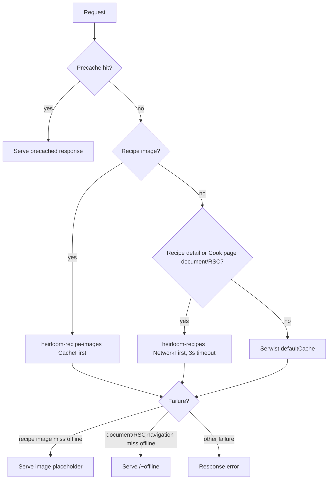

# PWA architecture

This document describes Heirloom's Serwist service worker, offline fallbacks, runtime caches, install manifest, update flow, and Cook Mode offline support.

## Source files

The PWA behavior is implemented in:

- [`src/app/sw.ts`](../src/app/sw.ts) for the Serwist service worker.
- [`next.config.js`](../next.config.js) for `@serwist/next` wiring and explicit precache entries.
- [`src/app/manifest.ts`](../src/app/manifest.ts) for the web app manifest and share target.
- [`src/app/~offline/page.tsx`](../src/app/~offline/page.tsx) for the offline navigation fallback.
- [`src/lib/offline-fallback.ts`](../src/lib/offline-fallback.ts), [`src/lib/recipe-image-cache.ts`](../src/lib/recipe-image-cache.ts), [`src/lib/recipe-page-cache.ts`](../src/lib/recipe-page-cache.ts), [`src/lib/cook-warm.ts`](../src/lib/cook-warm.ts), and [`src/lib/cook-notify.ts`](../src/lib/cook-notify.ts) for the unit-tested cache and notification helpers imported by the service worker.

## Serwist build wiring

[`next.config.js`](../next.config.js) wraps the Next config with `withSerwistInit`:

- `swSrc: "src/app/sw.ts"` and `swDest: "public/sw.js"` compile the TypeScript service worker into the public worker.
- The worker is disabled in development (`disable: process.env.NODE_ENV === "development"`).
- `reloadOnOnline: false` avoids reloading the app under an active Cook Mode session when connectivity returns.
- `additionalPrecacheEntries` explicitly precaches `/~offline` and `/img/recipe-image-placeholder.svg`, both revisioned by the deploy SHA or a build-time fallback.

The explicit fallback precache is necessary because the root layout reads cookies, so routes render dynamically and route HTML does not automatically land in the precache manifest. The service worker still receives Serwist's generated `self.__SW_MANIFEST` for revisioned build/app-shell assets and those explicit fallback URLs.

## Manifest and install surface

[`src/app/manifest.ts`](../src/app/manifest.ts) serves `/manifest.webmanifest` from brand and default-locale config. The manifest declares:

- standalone display with `display_override: ["standalone", "minimal-ui"]`;
- `launch_handler.client_mode: "navigate-existing"` so app launches reuse an installed window;
- `orientation: "any"` for landscape Cook Mode;
- app icons, maskable icon, shortcuts for new recipe, plan, and shopping;
- screenshots for richer install UI;
- a `share_target` that forwards shared links/text/photos to `/import`.

The `/import` route handler in [`src/app/import/route.ts`](../src/app/import/route.ts) redirects shared text/links into the recipe editor and uploads shared photos to Cloudinary only after `getCurrentUser()` succeeds.

## Runtime cache strategy

[`src/app/sw.ts`](../src/app/sw.ts) prepends two custom runtime caches before `...defaultCache`, so these routes win before Serwist's defaults.

| Cache name               | Strategy         | What it holds                                                                                                                                       | Bound                                                                                                                   |
| ------------------------ | ---------------- | --------------------------------------------------------------------------------------------------------------------------------------------------- | ----------------------------------------------------------------------------------------------------------------------- |
| Serwist precache         | Precache         | Generated revisioned app-shell/build assets plus `/~offline` and `/img/recipe-image-placeholder.svg` from `additionalPrecacheEntries`.              | Revisioned by the Serwist manifest and `buildRevision`.                                                                 |
| `heirloom-recipe-images` | `CacheFirst`     | Cloudinary-backed recipe and Cook Mode images, including direct `res.cloudinary.com` images and `/_next/image?url=<cloudinary>` optimizer requests. | `ExpirationPlugin`: 128 entries, 30 days, `purgeOnQuotaError`; `CacheableResponsePlugin` allows statuses `0` and `200`. |
| `heirloom-recipes`       | `NetworkFirst`   | Same-origin recipe detail and Cook Mode documents plus their RSC payloads.                                                                          | `networkTimeoutSeconds: 3`; `ExpirationPlugin`: 64 entries, 30 days, `purgeOnQuotaError`; only status `200` is cached.  |
| Serwist `defaultCache`   | Serwist defaults | Remaining Next.js/runtime requests not matched by the custom recipe caches.                                                                         | Defined by `@serwist/next/worker`.                                                                                      |

### Recipe images

[`src/lib/recipe-image-cache.ts`](../src/lib/recipe-image-cache.ts) restricts matches to `request.destination === "image"` and either:

- the exact Cloudinary host `res.cloudinary.com`; or
- the Next image optimizer path `/_next/image` whose decoded `url` parameter points at Cloudinary.

The cache uses `CacheFirst` because recipe photos are effectively immutable and should load instantly once stored. It permits opaque status `0` responses for cross-origin Cloudinary responses and uses an expiration plugin to cap storage.

### Recipe pages

[`src/lib/recipe-page-cache.ts`](../src/lib/recipe-page-cache.ts) matches only same-origin recipe detail pages (`/recipes/:id`) and Cook Mode pages (`/recipes/:id/cook`), including hard document navigations and RSC soft-navigation payloads. It intentionally excludes sibling routes such as `/recipes/new`, `/recipes/cook-with`, `/recipes/tags`, and `/recipes/:id/edit`.

The service worker uses `NetworkFirst`, deliberately not stale-while-revalidate. The reason is security: recipe pages are server-rendered per viewer and access-controlled. The HTML includes personalized state and owner-only controls, and the cache key is only the URL. On a shared family tablet, serving a cached recipe page before the network could reveal one viewer's authorized private/group render to another viewer. `NetworkFirst` fetches fresh authorized content whenever possible and falls back to the cache only offline or after the 3-second timeout.

## Offline fallbacks

The offline page lives at [`src/app/~offline/page.tsx`](../src/app/~offline/page.tsx). It explains that opened recipes and Cook Mode can still work offline and mounts [`OfflineReconnect`](../src/components/pwa/offline-reconnect.tsx), which reloads when the browser returns online and offers a manual retry.

Fallback matching is shared by [`src/lib/offline-fallback.ts`](../src/lib/offline-fallback.ts):

- hard navigations match `request.destination === "document"`;
- App Router soft navigations match the `RSC: 1` header.

[`src/app/sw.ts`](../src/app/sw.ts) configures Serwist fallback entries for `/~offline` and the recipe-image placeholder. It also adds a global `serwist.setCatchHandler`. That extra handler exists because Serwist's built-in fallback plugin attaches only when a route handler is an `instanceof` its own `Strategy`; the `@serwist/next` default routes can come from a duplicate installed `serwist` copy, so that `instanceof` check can fail. The global catch handler reliably serves the precached offline page for failed document/RSC navigations regardless of which Serwist copy created the matched route.

## Update flow

The service worker is created with:

- `skipWaiting: false`;
- `clientsClaim: true`;
- `navigationPreload: true`.

With `skipWaiting: false`, a newly installed worker enters `waiting` instead of immediately taking over. Serwist listens for `{ type: "SKIP_WAITING" }` and calls `self.skipWaiting()` when it receives that message.

The client side is in [`src/components/pwa/update-prompt.tsx`](../src/components/pwa/update-prompt.tsx), with the message constant in [`src/lib/sw-update.ts`](../src/lib/sw-update.ts). The prompt appears only when there is both an existing controller and a waiting worker, which means it is a real update, not first install. Accepting the prompt posts `SKIP_WAITING`; when `controllerchange` fires, the page reloads once. The prompt is mounted in [`src/app/(main)/layout.tsx`](<../src/app/(main)/layout.tsx>), not in immersive routes, and it defers while Cook Mode has running timers.

## Cook Mode warming and notifications

[`src/components/cook/cook-bundle-warmer.tsx`](../src/components/cook/cook-bundle-warmer.tsx) is mounted on the recipe detail page. When the browser is idle it:

1. calls `router.prefetch()` for the Cook Mode route; and
2. posts a `WarmCookBundleMessage` from [`src/lib/cook-warm.ts`](../src/lib/cook-warm.ts) to the active service worker.

The service worker handles that message with `warmCookBundle()` in [`src/app/sw.ts`](../src/app/sw.ts). It adds Cook page URLs to `heirloom-recipes` and exact Cloudinary image URLs to `heirloom-recipe-images`, reusing the existing bounded caches instead of creating separate warm caches. Failures are swallowed because warming is best-effort.

Cook timer notification payloads are built in [`src/lib/cook-notify.ts`](../src/lib/cook-notify.ts). The service worker handles `notificationclick` for `type: "cook-timer"` only: it closes the notification, looks for an existing window whose pathname matches the Cook Mode URL, focuses it if found, or opens a new window otherwise.

## Request flow

_Related issue: #195._
